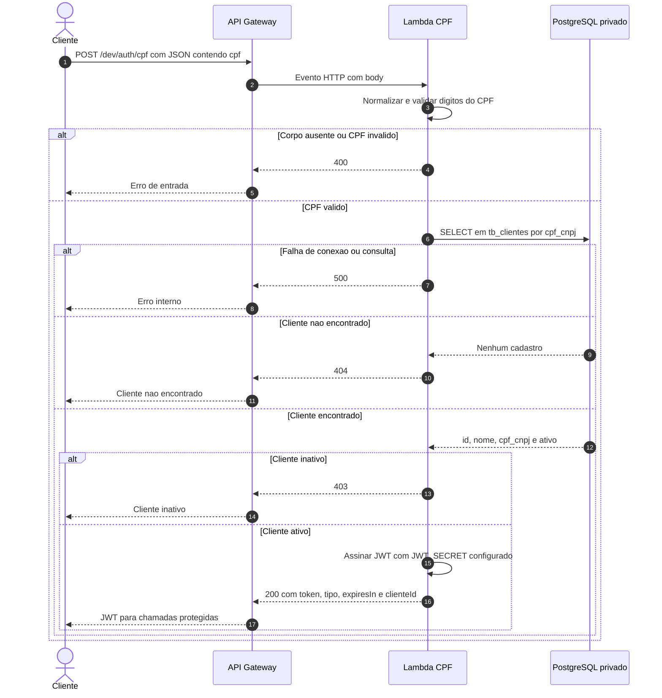
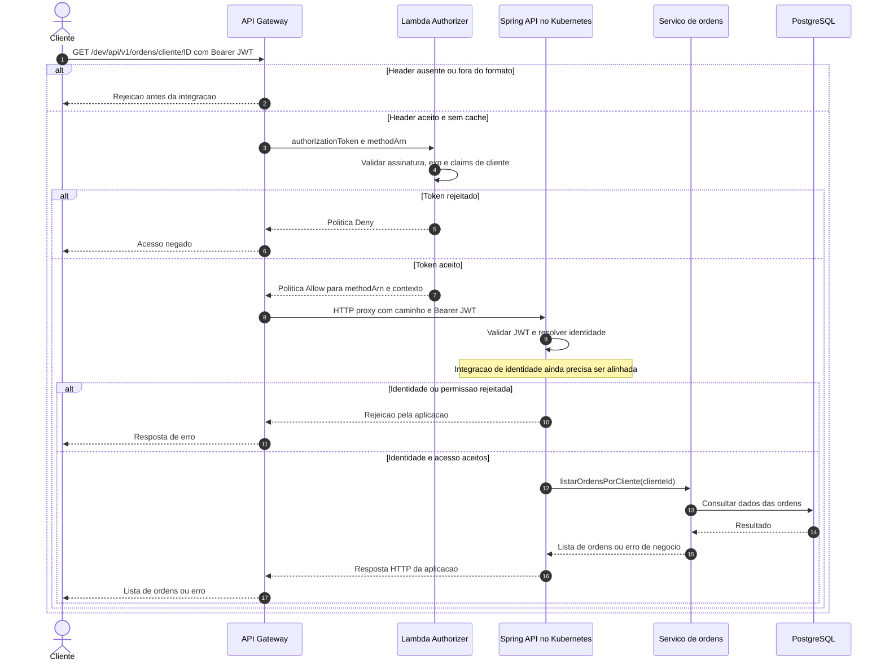
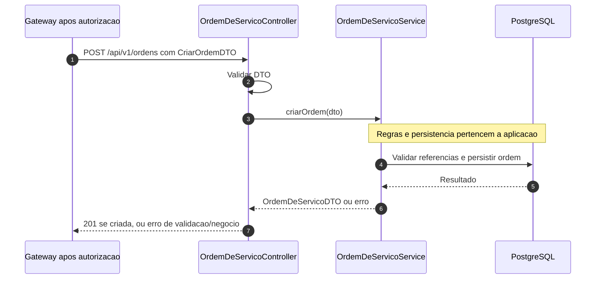

# Diagramas de sequência — autenticação e ordem de serviço

Estes diagramas usam Mermaid e podem ser visualizados diretamente no GitHub. As setas contínuas representam chamadas; as tracejadas, respostas. Os blocos `alt` mostram caminhos alternativos.

Base da documentação: Lambda `d99087c`, Spring API `080b582` e branch de integração JWT `87db07e`, consultadas em 10/09/2026. Os diagramas documentam o código e o contrato de integração; não constituem evidência de deploy ou teste na conta do grupo.

## 1. Autenticação do cliente por CPF

O cliente envia um CPF, a Lambda verifica o cadastro e, se ele estiver ativo, devolve uma credencial temporária. O CPF é normalizado antes da consulta; o banco deve conter o documento no formato compatível com essa busca.

O endpoint de autenticação é público. JSON malformado cai atualmente no tratamento genérico de erro e retorna 500; não está implementado como 400. A consulta ao RDS exige rede e permissões configuradas pelo grupo.

## 2. Consulta de ordens de serviço com JWT

Exemplo concreto: `GET /dev/api/v1/ordens/cliente/{clienteId}`. O prefixo `/dev` pertence ao stage do Gateway; a aplicação recebe `/api/v1/ordens/cliente/{clienteId}`. A operação listada existe em `OrdemDeServicoController.listarPorCliente`.

O diagrama abaixo mostra uma chamada sem decisão já armazenada em cache. A aceitação na Spring depende do alinhamento de identidade descrito na RFC.

O Authorizer não consulta o banco a cada chamada e não verifica se o ID solicitado pertence ao cliente do token. Essa autorização por recurso deve ser garantida pela aplicação. O contexto retornado pelo Authorizer também não substitui automaticamente a identidade esperada pela Spring.

O Gateway está configurado com cache de 300 segundos. Uma decisão em cache pode dispensar a chamada ao Authorizer. Como a política atual é específica ao `methodArn`, reutilizar o mesmo token em outra rota pode produzir negação implícita. Expiração, troca de chave e múltiplas rotas devem ser testadas levando esse cache em conta; veja a [RFC](rfc-001-autenticacao.md).

## 3. Abertura de uma ordem (contrato da aplicação)

A abertura usa `POST /dev/api/v1/ordens` pelo Gateway. A mesma etapa de autorização do diagrama anterior ocorre antes do controller. Este recorte começa após a identidade ter sido aceita.

Não se presume aqui aprovação, pagamento ou transição automática de status. O payload e as regras finais devem ser confirmados com a equipe da aplicação antes da gravação.
